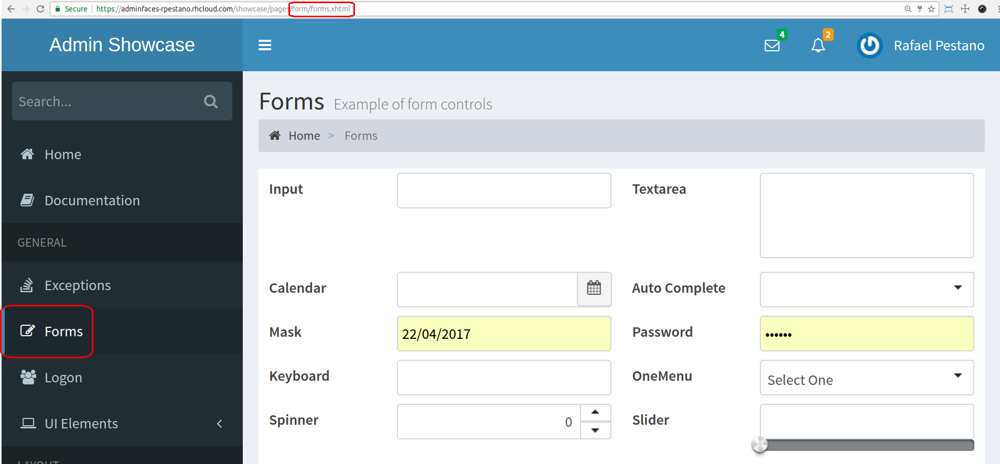

= Admin Template
:page-layout: base
:source-language: java
:icons: font
:linkattrs:
:sectanchors:
:sectlink:
:numbered:
:doctype: book
:toc: preamble
:tip-caption: :bulb:
:note-caption: :information_source:
:important-caption: :heavy_exclamation_mark:
:caution-caption: :fire:
:warning-caption: :warning:

image:https://maven-badges.herokuapp.com/maven-central/com.github.adminfaces/admin-template/badge.svg["Maven Central",link="http://search.maven.org/#search|ga|1|admin-template"]
image:https://badges.gitter.im/Join%20Chat.svg[link="https://gitter.im/adminfaces?utm_source=badge&utm_medium=badge&utm_campaign=pr-badge&utm_content=badge"]

A https://javaserverfaces.java.net/[JSF^] *fully responsive* `admin template` based on http://primefaces.org/themes[Primefaces^], https://almsaeedstudio.com/themes/AdminLTE/index2.html[Admin LTE^] and http://getbootstrap.com[Bootstrap^].

== Features

Below is a non exhaustive list of notable features brought out of the box by this template:

* Fully responsive
** Its based on Bootstrap and AdminLTE two well tested and solid frameworks
* Mobile and PWA friendly
* Some functionalities are enabled only on mobile devices, like:
** Material design load bar
** Ripple effect based on http://materializecss.com/waves.html[materialize^] +
image:https://user-images.githubusercontent.com/1592273/27104868-d9bfb33e-5063-11e7-83be-2201a3f8cda5.gif[]
** Touch enabled menu to slide in/out +
image:https://cloud.githubusercontent.com/assets/1592273/25071807/dd37121e-2296-11e7-855c-8f20b59dcf5f.gif[]
** Scroll to top
* Automatically activates (highlight) menu based on current page +

* Custom <<Error Pages, error pages>>
* Configurable, see <<Configuration>>
* http://adminfaces-rpestano.rhcloud.com/showcase/pages/layout/breadcrumb.xhtml[Breadcrumb^] based navigation
* Back to previous screen when logging in again after session expiration (or accessing a page via url without being logged in)

NOTE: Most of the above features can be disabled via <<Configuration,configuration>> mechanism;

== Usage

First include it in your classpath:

----
<dependency>
    <groupId>com.github.adminfaces</groupId>
    <artifactId>admin-template</artifactId>
    <version>version</version>
</dependency>
----

[IMPORTANT]
======
Admin template will bring the following transitive dependencies:

----
<dependency>
    <groupId>com.github.adminfaces</groupId>
    <artifactId>admin-theme</artifactId>
    <version>version</version>
</dependency>
<dependency>
    <groupId>org.primefaces</groupId>
    <artifactId>primefaces</artifactId>
    <version>6.0</version>
</dependency>

<dependency>
    <groupId>org.omnifaces</groupId>
    <artifactId>omnifaces</artifactId>
    <version>2.1</version>
</dependency>
----    

Of cource you can override them in your pom.xml as needed.
======

Now you can use it in your JSF pages:

[source,html]
----
<?xml version="1.0" encoding="UTF-8"?>
<ui:composition xmlns="http://www.w3.org/1999/xhtml"
                xmlns:ui="http://java.sun.com/jsf/facelets"
                xmlns:p="http://primefaces.org/ui"
                template="/admin.xhtml"> <1>

    <ui:define name="head">
        <title>Admin Starter</title>
    </ui:define>

    <ui:define name="logo-lg">
        Admin Starter
    </ui:define>

    <ui:define name="logo-mini">
        Admin
    </ui:define>

    <ui:define name="menu">
        <ul class="sidebar-menu">
            <li>
                <p:link href="/index.xhtml" onclick="clearBreadCrumbs()">
                    <i class="fa fa-home"></i>
                    Home
                </p:link>
            </li>
	        <li class="header">
	            General
	        </li>
	        <li>
	            <p:link href="/car-list.xhtml">
	                <i class="fa fa-car"></i>
	                Cars
	            </p:link>
	        </li>
        </ul>
     </ui:define>

    <ui:define name="top-menu">
        <ui:include src="/includes/top-bar.xhtml"/>
    </ui:define>
    
      <ui:define name="title">
        <h2 class="align-center">
            Welcome to the  <i><a href="https://github.com/adminfaces/admin-starter" target="_blank"
                                                          style="text-transform: none;text-decoration: none"> AdminFaces Starter</a></i> Project!
             
            <small>Integrating <p:link value="Primefaces" href="http://primefaces.org"/>, <p:link value="Bootstrap"
                                                                                                  href="http://getbootstrap.com/"/> and
                <p:link value="Admin LTE" href="https://almsaeedstudio.com/themes/AdminLTE/index2.html/"/> into your
                <p:link value="JSF" href="https://javaserverfaces.java.net/"/> application.
            </small>
        </h2>
    </ui:define>

    <ui:define name="description">
        A page description
    </ui:define>

    <ui:define name="body">
    	<h2>Page body</h2>
    </ui:define>

    <ui:define name="footer">
          <a target="_blank"
           href="https://github.com/adminfaces/">
            Copyright (C) 2017 - AdminFaces
        </a>

        

            <i>1.0.0</i>
        

    </ui:define>

</ui:composition>
----
<1> /admin.xhtml is the location of the template

The above page definition renders as follows:

image:template-example.png[]

There are also other regions defined in admin.xhtml template, https://raw.githubusercontent.com/adminfaces/admin-template/master/admin-template-regions.png[see here^].

== Configuration

Template configuration is made through `admin-config.properties` file present in `src/main/resources` folder.

Here are the default values as well as its description:

----
admin.loginPage=login.xhtml <1>
admin.indexPage=index.xhtml <2>
admin.dateFormat=MM/dd/yyyy HH:mm:ss <3>
admin.templatePath=admin.xhtml <4>
admin.breadcrumbSize=5 <5>
admin.renderMessages=true <6>
admin.renderAjaxStatus=true <7>
admin.disableFilter=false <8>
admin.renderBreadCrumb=true <9>
admin.enableSlideMenu=true <10>
admin.enableRipple=true <11>
admin.rippleElements= .ripplelink,button.ui-button,.ui-selectlistbox-item,.ui-multiselectlistbox-item,.ui-selectonemenu-label,.ui-selectcheckboxmenu,\
.ui-autocomplete-dropdown, .ui-autocomplete-item ... (the list goes on) <12>
admin.skin=skin-blue <13>

----
<1> login page location (relative to webapp). It you only be used if you configure <<Admin Session>>.
<2> index page location. User will be redirected to it when it access app root (contextPath/).
<3> Date format used in error page (https://raw.githubusercontent.com/adminfaces/admin-template/master/src/main/resources/META-INF/resources/500.xhtml[500.xhtml^]).
<4> facelets template to be used on build in admin-template pages like 500.xhtml, 404.xhtml, viewexpired.xhtml, see <<Error Pages>>. By default it uses admin.xhtml but you can define any template (e.g one that extends admin.xhtml).
<5> Number of breadcrumbs to queue before removing the older ones.
<6> When false, p:messages defined in admin template will not be rendered.
<7> When false ajaxStatus, which triggers the loading bar on every ajax request, will not be rendered.
<8> Disables AdminFilter, responsible for redirecting user after session timeout, sending user to logon page when it is not logged in among other things.
<9> When false, the breadCrumb component, declared in admin template, will not be rendered.
<10> If true will make left menu touch enable (can be closed or opened via touch)
<11> When true it will create a http://materializecss.com/waves.html#![wave/ripple effect^] on elements specified by `rippleElements`.
<12> A list of comma separated list of (jquery) selector which elements will be affected by ripple effect.
<13> Default template skin

IMPORTANT: You don't need to declare all values in your admin-config.properties, you can specify only the ones you need in order to change.

== Admin Session

AdminSession is a simple session scoped bean which controls whether user is logged in or not.

----
 public boolean isLoggedIn(){
        return isLoggedIn; //always true by default
    }
----

By default the user *is always logged in* and you need to override it (by using https://github.com/adminfaces/admin-starter/blob/2659e762271f9e1864bd2290f3dbf5018087eccd/src/main/java/com/github/adminfaces/starter/infra/security/LogonMB.java#L28[bean specialization^] or calling `setIsLoggedIn()` method) to change its value.

When isLoggedIn is `false` you got the following mechanisms activated:

. Access to any page, besides the login, redirects user to login;
. When session is expired user is redirected to logon and current page (before expiration) is saved so user is redirected back to where it was before session expiration.

NOTE: It is up to you to decide whether the user is logged in or not.

== Snapshots

Snapshots are published to https://oss.sonatype.org/content/repositories/snapshots/com/github/adminfaces/[maven central^] on each commit, to use it just declare the repository below on your `pom.xml`:

[source,xml]
----
<repositories>
    <repository>
        <snapshots/>
        <id>snapshots</id>
        <name>libs-snapshot</name>
        <url>https://oss.sonatype.org/content/repositories/snapshots</url>
    </repository>
</repositories>
----