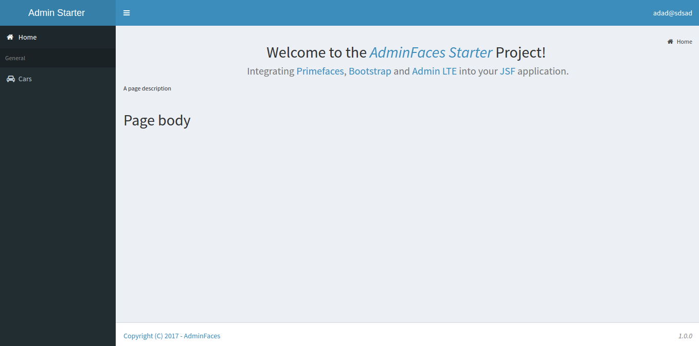

= Admin Template
:page-layout: base
:source-language: java
:icons: font
:linkattrs:
:sectanchors:
:sectlink:
:numbered:
:doctype: book
:toc: preamble
:tip-caption: :bulb:
:note-caption: :information_source:
:important-caption: :heavy_exclamation_mark:
:caution-caption: :fire:
:warning-caption: :warning:

image:https://travis-ci.org/adminfaces/admin-template.svg[Build Status (Travis CI), link=https://travis-ci.org/adminfaces/admin-template]
image:https://maven-badges.herokuapp.com/maven-central/com.github.adminfaces/admin-template/badge.svg["Maven Central",link="http://search.maven.org/#search|ga|1|admin-template"]
image:https://badges.gitter.im/Join%20Chat.svg[link="https://gitter.im/adminfaces?utm_source=badge&utm_medium=badge&utm_campaign=pr-badge&utm_content=badge"]

A https://javaserverfaces.java.net/[JSF^] *fully responsive* `admin template` based on http://primefaces.org/themes[Primefaces^], https://almsaeedstudio.com/themes/AdminLTE/index2.html[Admin LTE^] and http://getbootstrap.com[Bootstrap^].

== Features

Below is a non exhaustive list of notable features brought out of the box by this template:

* Fully *responsive*
** Its based on Bootstrap and AdminLTE two well tested and solid frameworks
* Enhanced mobile experience
** Material design load bar
** Material design flat buttons
** Ripple effect based on http://materializecss.com/waves.html[materialize css^] +
image:https://user-images.githubusercontent.com/1592273/27104868-d9bfb33e-5063-11e7-83be-2201a3f8cda5.gif[]
** Touch enabled menu to slide in/out and show navbar on scroll up +
image:https://cloud.githubusercontent.com/assets/1592273/25071807/dd37121e-2296-11e7-855c-8f20b59dcf5f.gif[]
** Auto show and hide navbar based on page scroll 
** Scroll to top
* Automatically activates (highlight) menu based on current page +
image:https://github.com/adminfaces/admin-showcase/raw/master/src/docs/images/menu-highlight.png[link="https://github.com/adminfaces/admin-showcase/blob/master/src/docs/images/menu-highlight.png?raw=true"]
* Custom <<Error Pages, error pages>>
* Two menu modes, left and horizontal based menu
* Configurable, see <<Configuration>>
* http://admin-showcase-admin-showcase.7e14.starter-us-west-2.openshiftapps.com/showcase/pages/layout/breadcrumb.xhtml[Breadcrumb^] based navigation
* Layout customization via <<Control Sidebar>>
* High resolution and responsible icons based on Glyphycons and FontAwesome
* Menu itens search +
image:https://github.com/adminfaces/admin-showcase/raw/master/src/docs/images/menu-search.png[link="https://github.com/adminfaces/admin-showcase/blob/master/src/docs/images/menu-search.png?raw=true"]
* Builtin `dark` and `light` skins
* Back to previous screen when logging in again after session expiration (or accessing a page via url without being logged in)

NOTE: Most of the above features can be enabled/disabled via <<Configuration,configuration>> mechanism.

== Usage

First include it in your classpath:

----
<dependency>
    <groupId>com.github.adminfaces</groupId>
    <artifactId>admin-template</artifactId>
    <version>version</version>
</dependency>
----

[WARNING]
====
Admin template will bring the following transitive dependencies:

----
<dependency>
    <groupId>com.github.adminfaces</groupId>
    <artifactId>admin-theme</artifactId>
    <version>version</version>
</dependency>
<dependency>
    <groupId>org.primefaces</groupId>
    <artifactId>primefaces</artifactId>
    <version>6.2</version>
</dependency>

<dependency>
    <groupId>org.omnifaces</groupId>
    <artifactId>omnifaces</artifactId>
    <version>2.1</version>
</dependency>

----    

Which you can override in your pom.xml as needed.
====

With the template dependency in classpath now you can use `admin` facelets template into your JSF pages.

=== Example

Consider the following sample page:

[source,html]
----
<?xml version="1.0" encoding="UTF-8"?>
<ui:composition xmlns="http://www.w3.org/1999/xhtml"
                xmlns:ui="http://java.sun.com/jsf/facelets"
                xmlns:p="http://primefaces.org/ui"
                template="/admin.xhtml"> <1>

    <ui:define name="head">
        <title>Admin Starter</title>
    </ui:define>

    <ui:define name="logo-lg">
        Admin Starter
    </ui:define>

    <ui:define name="logo-mini">
        Admin
    </ui:define>

    <ui:define name="menu">
        <ul class="sidebar-menu">
            <li>
                <p:link href="/index.xhtml" onclick="clearBreadCrumbs()">
                    <i class="fa fa-home"></i>
                    Home
                </p:link>
            </li>
	        <li class="header">
	            General
	        </li>
	        <li>
	            <p:link href="/car-list.xhtml">
	                <i class="fa fa-car"></i>
	                Cars
	            </p:link>
	        </li>
        </ul>
     </ui:define>

    <ui:define name="top-menu">
        <ui:include src="/includes/top-bar.xhtml"/>
    </ui:define>
    
      <ui:define name="title">
        <h2 class="align-center">
            Welcome to the  <i><a href="https://github.com/adminfaces/admin-starter" target="_blank"
                                                          style="text-transform: none;text-decoration: none"> AdminFaces Starter</a></i> Project!
             
            <small>Integrating <p:link value="Primefaces" href="http://primefaces.org"/>, <p:link value="Bootstrap"
                                                                                                  href="http://getbootstrap.com/"/> and
                <p:link value="Admin LTE" href="https://almsaeedstudio.com/themes/AdminLTE/index2.html/"/> into your
                <p:link value="JSF" href="https://javaserverfaces.java.net/"/> application.
            </small>
        </h2>
    </ui:define>

    <ui:define name="description">
        A page description
    </ui:define>

    <ui:define name="body">
    	<h2>Page body</h2>
    </ui:define>

    <ui:define name="footer">
          <a target="_blank"
           href="https://github.com/adminfaces/">
            Copyright (C) 2017 - AdminFaces
        </a>

        

            <i>1.0.0</i>
        

    </ui:define>

</ui:composition>
----
<1> /admin.xhtml is the location of the template

The above page definition renders as follows:

There are also other regions defined in admin.xhtml template, https://github.com/adminfaces/admin-template/blob/master/src/main/resources/META-INF/resources/admin.xhtml[see here^].

[TIP]
====
A good practice is to define a template on your application which extends the admin template, see https://github.com/adminfaces/admin-starter/blob/master/src/main/webapp/WEB-INF/templates/template.xhtml[admin-starter application template here^].

So in your pages you use your template instead of admin.
====

== Application template

Instead of repeating sections like *menu*, *logo*, *head* and *footer* on every page we can create a template inside our application which uses `admin.xhtml` as template:

./WEB-INF/templates/template.xhtml
[source,html]
----
<?xml version="1.0" encoding="UTF-8"?>
<ui:composition xmlns="http://www.w3.org/1999/xhtml"
                xmlns:ui="http://java.sun.com/jsf/facelets"
                xmlns:p="http://primefaces.org/ui"
                template="/admin.xhtml"> 

    <ui:define name="head">
            <title>Admin Starter</title>
            <h:outputStylesheet library="css" name="starter.css"/>
    </ui:define>

    <ui:define name="logo-lg">
        Admin Starter
    </ui:define>

    <ui:define name="logo-mini">
        Admin
    </ui:define>

    <ui:define name="menu">
        <ul class="sidebar-menu">
            <li>
                <p:link href="/index.xhtml" onclick="clearBreadCrumbs()">
                    <i class="fa fa-home"></i>
                    Home
                </p:link>
            </li>
	        <li class="header">
	            General
	        </li>
	        <li>
	            <p:link href="/car-list.xhtml">
	                <i class="fa fa-car"></i>
	                Cars
	            </p:link>
	        </li>
        </ul>
     </ui:define>

    <ui:define name="top-menu">
        <ui:include src="/includes/top-bar.xhtml"/>
    </ui:define>

    <ui:define name="footer">
        <a target="_blank"
           href="https://github.com/adminfaces/">
            Copyright (C) 2017 - AdminFaces
        </a>

        

            <i>1.0.0</i>
        

    </ui:define>

</ui:composition>   
----

And now the page can just define its content and title:

./webapp/mypage.xhtml
[source,xml]
----
<?xml version="1.0" encoding="UTF-8"?>
<ui:composition xmlns="http://www.w3.org/1999/xhtml"
                xmlns:ui="http://java.sun.com/jsf/facelets"
                xmlns:p="http://primefaces.org/ui"
                template="/WEB-INF/templates/template.xhtml"> 

    <ui:define name="title">
        A page title
    </ui:define>

    <ui:define name="description">
        A page description
    </ui:define>

    <ui:define name="body">
    	<h2>Page body</h2>
    </ui:define>

</ui:composition>   
----

=== Switching between *left menu* and *top menu* templates

AdminFaces supports two layout modes, one is *left based menu* and the other is *top based menu*. 

The user can change layout modes via <<Control Sidebar, control sidebar>> but to make it work you have to use *LayoutMB* to define page template:

./webapp/mypage.xhtml
[source,xml]
----
<?xml version="1.0" encoding="UTF-8"?>
<ui:composition xmlns="http://www.w3.org/1999/xhtml"
                xmlns:ui="http://java.sun.com/jsf/facelets"
                xmlns:p="http://primefaces.org/ui"
                template="#{layoutMB.template}"> 

<!-- page content -->

</ui:composition> 
----

As a *convention over configuration* LayoutMB will load templates from the following locations:

* `webapp/WEB-INF/templates/template.xhtml` for the `left menu` based template 
* `webapp/WEB-INF/templates/template-top.xhtml` for horizontal menu layout.

See admin-starer templates for a reference: https://github.com/adminfaces/admin-starter/tree/master/src/main/webapp/WEB-INF/templates

== Configuration

Template configuration is made through `admin-config.properties` file present in `src/main/resources` folder.

Here are the default values as well as its description:

----
admin.loginPage=login.xhtml <1>
admin.indexPage=index.xhtml <2>
admin.dateFormat= <3>
admin.breadcrumbSize=5 <4>
admin.renderMessages=true <5>
admin.renderAjaxStatus=true <6>
admin.disableFilter=false <7>
admin.renderBreadCrumb=true <8>
admin.enableSlideMenu=true <9>
admin.enableRipple=true <10>
admin.rippleElements= .ripplelink,button.ui-button,.ui-selectlistbox-item,.ui-multiselectlistbox-item,.ui-selectonemenu-label,.ui-selectcheckboxmenu,\
.ui-autocomplete-dropdown, .ui-autocomplete-item ... (the list goes on) <11>
admin.skin=skin-blue <12>
admin.autoShowNavbar=true <13>
admin.ignoredResources= <14>
admin.loadingImage=ajaxloadingbar.gif <15>
admin.extensionLessUrls=false <16>
admin.renderControlSidebar=false <17>
admin.controlSidebar.showOnMobile=false <18>
admin.controlSidebar.leftMenuTemplate=true <19>
admin.controlSidebar.fixedLayout=false <20>
admin.controlSidebar.sidebarCollapsed=false <21>
admin.controlSidebar.expandOnHover=false <22>
admin.controlSidebar.fixed=false <23>
admin.controlSidebar.darkSkin=true <24>
admin.rippleMobileOnly=true <25>
admin.renderMenuSearch=true <26>
admin.autoHideMessages=true <27>
admin.messagesHideTimeout=2500 <28>

----
<1> login page location (relative to webapp). It you only be used if you configure <<Admin Session>>.
<2> index page location. User will be redirected to it when it access app root (contextPath/).
<3> Date format used in error page (http://admin-showcase-admin-showcase.7e14.starter-us-west-2.openshiftapps.com/showcase/500.xhtml[500.xhtml^]), by default it is JVM default format.
<4> Number of breadcrumbs to queue before removing the older ones.
<5> When false, p:messages defined in admin template will not be rendered.
<6> When false ajaxStatus, which triggers the loading bar on every ajax request, will not be rendered.
<7> Disables AdminFilter, responsible for redirecting user after session timeout, sending user to logon page when it is not logged in among other things.
<8> When false, the breadCrumb component, declared in admin template, will not be rendered.
<9> If true will make left menu touch enable (can be closed or opened via touch). Can be enable/disabled per page with <ui:param name="enableSlideMenu" value="false".
<10> When true it will create a http://materializecss.com/waves.html#![wave/ripple effect^] on elements specified by `rippleElements`.
<11> A list of comma separated list of (jquery) selector which elements will be affected by ripple effect.
<12> Default template skin
<13> Automatic shows navbar when users scrolls page up (on small screens). Can be enable/disabled per page with <ui:param name="autoShowNavbar" value="false".
<14> Comma separated resources (pages or urls) to be skiped by AdminFilter. Ex: /rest,/pages/car-list.xhtml. Note that by default the filter skips pages under *CONTEXT/public/* folder.
<15> image used for the loading popup. It must be under `webapp/resources/images` folder.
<16> Removes extension suffix from breadCrumb links.
<17> When true it will activate <<Control Sidebar, control sidebar>> component.
<18> When true control sidebar will be also rendered on mobile devices. 
<19> Switches layout between left (default) and top menu.
<20> Toggles fixed layout where navbar is fixed on the page.
<21> When true left sidebar will be collapsed.
<22> When true left sidebar will expand on mouse hover.
<23> When true control sidebar will be fixed on the page.
<24> Changes control sidebar skin between `dark` and `light`.
<25> When true the ripple effect will be enabled only on mobile (small) screens. 
<26> Enables or disables menu  search. 
<27> If true PrimeFaces *info* messages will be hidden after a certain timeout.
<28> Timeout to hide info messages. Note that the timeout is also composed by `configured timeout + number of words` in message.

IMPORTANT: You don't need to declare all values in your admin-config.properties, you can specify only the ones you need to change.

TIP: Since vRC16 config properties can be passed as Java `system properties`.

NOTE: Controlsidebar entries (admin.controlSidebar.xxx) will be used only for initial/default values because they will be stored on browser local storage as soon as user changes them. 

== Admin Session

AdminSession is a simple session scoped bean which controls whether user is logged in or not.

----
 public boolean isLoggedIn(){
        return isLoggedIn; //always true by default
    }
----

By default the user *is always logged in* and you need to override it (by using https://github.com/adminfaces/admin-starter/blob/2659e762271f9e1864bd2290f3dbf5018087eccd/src/main/java/com/github/adminfaces/starter/infra/security/LogonMB.java#L28[bean specialization^] or via injection and calling `setIsLoggedIn()` method) to change its value, see <<Overriding AdminSession>>.

When isLoggedIn is `false` you got the following mechanisms activated:

. Access to any page, besides the login, redirects user to login;
. When session is expired user is redirected to logon and current page (before expiration) is saved so user is redirected back to where it was before session expiration.

NOTE: It is up to you to decide whether the user is logged in or not.

=== Overriding AdminSession

There are two ways to override AdminSession default value which is <<AdminSession Specialization, specialization>> and <<AdminSession Injection, injection>>.

==== AdminSession Specialization

A simple way to change AdminSession logged in value is by extending it:

[source,java]
----
import javax.enterprise.context.SessionScoped;
import javax.enterprise.inject.Specializes;
import com.github.adminfaces.template.session.AdminSession;
import org.omnifaces.util.Faces;
import java.io.Serializable;

@SessionScoped
@Specializes
public class LogonMB extends AdminSession implements Serializable {

    private String currentUser;
    private String email;
    private String password;
    private boolean remember;

    public void login() throws IOException {
        currentUser = email;
        addDetailMessage("Logged in successfully as <b>" + email + "</b>");
        Faces.getExternalContext().getFlash().setKeepMessages(true);
        Faces.redirect("index.xhtml");
    }

    @Override
    public boolean isLoggedIn() {

        return currentUser != null;
    }

    //getters&setters
}
----

=== AdminSession Injection

Another way is to inject it into your security authentication logic:

[source,java]
----
import com.github.adminfaces.template.session.AdminSession;
import org.omnifaces.util.Messages;
import org.omnifaces.util.Faces;

@SessionScoped
@Named("authorizer")
public class CustomAuthorizer implements Serializable {

    private String currentUser;

    @Inject
    AdminSession adminSession;

    public void login(String username) {
        currentUser = username;
        adminSession.setIsLoggedIn(true);
        Messages.addInfo(null,"Logged in sucessfully as <b>"+username+"</b>");
        Faces.redirect("index.xhtml");
    }

}
----

IMPORTANT: As isLoggedIn is `true by default` you need to set it to false on application startup so user is redirected to login page. This step is not needed when <<AdminSession Specialization>>.

== Error Pages

The template comes with custom error pages like `403`, `404`, `500`, `ViewExpired` and `OptimisticLock`.

.500
User is going to be redirected to http://admin-showcase-admin-showcase.7e14.starter-us-west-2.openshiftapps.com/showcase/500.xhtml[*500.xhtml*^] whenever a _500_ response code is returned in a request.

The page will also be triggered when a `Throwable` is raised (and not catch).

Here is how 500 page look like:

image::https://raw.githubusercontent.com/adminfaces/admin-showcase/master/src/docs/images/500.png[]

.403
User is redirected to http://admin-showcase-admin-showcase.7e14.starter-us-west-2.openshiftapps.com/showcase/403.xhtml[403.xhtml^] whenever a _403_ response code is returned in a request. The page will also be triggered when a `com.github.adminfaces.template.exception.AccessDeniedException` is raised.

image::https://raw.githubusercontent.com/adminfaces/admin-showcase/master/src/docs/images/403.png[]

.404
User will be redirected to http://admin-showcase-admin-showcase.7e14.starter-us-west-2.openshiftapps.com/showcase/non-existing.xhtml[404.xhtml^] whenever a 404 response code is returned from a request.

image::https://raw.githubusercontent.com/adminfaces/admin-showcase/master/src/docs/images/404.png[]

.ViewExpired
When a JSF `javax.faces.application.ViewExpiredException` is raised user will be redirected to http://admin-showcase-admin-showcase.7e14.starter-us-west-2.openshiftapps.com/showcase/expired.xhtml[expired.xhtml^].

image::https://raw.githubusercontent.com/adminfaces/admin-showcase/master/src/docs/images/expired.png[]

.OptimisticLock
When a JPA `javax.persistence.OptimisticLockException` is thrown user will be redirected to http://admin-showcase-admin-showcase.7e14.starter-us-west-2.openshiftapps.com/showcase/optimistic.xhtml[optimistic.xhtml^].

image::https://raw.githubusercontent.com/adminfaces/admin-showcase/master/src/docs/images/optimistic.png[]

=== Providing custom error pages

You can provide your own custom pages (and other status codes) by configuring them in web.xml, example:

[source,xml]
----
<error-page>
    <error-code>404</error-code>
    <location>/404.xhtml</location>
</error-page>
<error-page>
    <error-code>500</error-code>
    <location>/500.xhtml</location>
</error-page>
<error-page>
    <exception-type>java.lang.Throwable</exception-type>
    <location>/500.xhtml</location>
</error-page>
----

=== Overriding error pages

You can also override error pages by placing the pages (with same name) described in <<Error Pages>> section on the root of your application (`webapp/`).

== Internationalization

Labels in <<Error Pages, error pages>> and <<Control Sidebar, control sidebar>> are provided via http://docs.oracle.com/javaee/6/tutorial/doc/bnaxw.html#bnaxy[JSF resource bundle] mechanism.

Following are the default labels in admin resource bundle:

.src/main/resources/admin.properties
----
#general
admin.version=${project.version}
label.go-back=Go back to

#403
label.403.header=403
label.403.message=Access denied! You do not have access to the requested page.

#404
label.404.header=404
label.404.message=Oops! Page not found

#500
label.500.header=500
label.500.message=Oops! Something went wrong
label.500.title=Unexpected error
label.500.detail=Details

#expired
label.expired.title=View expired
label.expired.message= The requested page could not be recovered.
label.expired.click-here= Click here to reload the page.

#optimistic
label.optimistic.title=Record already updated
label.optimistic.message= The requested record has been already updated by another user.
label.optimistic.click-here= Click here to reload the updated record from database.

#controlsidebar
controlsidebar.header=Layout Options
controlsidebar.label.restore-defaults=Restore defaults
controlsidebar.label.menu-horientation=Left menu layout
controlsidebar.txt.menu-horientation=Toggle menu orientation between <b class\="sidebar-bold">left</b> and <b class\="sidebar-bold">top</b> menu.
controlsidebar.label.fixed-layout=Fixed Layout
controlsidebar.txt.fixed-layout=Activate the fixed layout, if checked the top bar will be fixed on the page.
controlsidebar.label.boxed-layout=Boxed Layout
controlsidebar.txt.boxed-layout=Activate the boxed layout.
controlsidebar.label.sidebar-collapsed=Collapsed Sidebar
controlsidebar.txt.sidebar-collapsed=If checked the sidebar menu will be collapsed.
controlsidebar.label.sidebar-expand-hover=Sidebar Expand on Hover
controlsidebar.txt.sidebar-expand-hover=If checked the left sidebar will expand on hover.
controlsidebar.label.sidebar-slide=Control Sidebar fixed
controlsidebar.txt.sidebar-slide=If checked control sidebar will be fixed on the page.
controlsidebar.label.sidebar-skin=Dark Sidebar Skin
controlsidebar.txt.sidebar-skin=If checked <b class\="sidebar-bold">dark</b> skin will be used for control sidebar, otherwise <b class\="sidebar-bold">light</b> skin will be used.
controlsidebar.header.skins=Skins
----

[TIP] 
====
You can provide your own language bundle adding a file named _admin_YOUR_LANGUAGE.properties_ in your application `resources` folder. 

Don't forget to add it as `supported locale` in *faces-config*, see https://github.com/adminfaces/admin-template/blob/02c0db5d9ff567c803e7e83f336f8a7308e9d4ec/src/main/resources/META-INF/faces-config.xml#L9[example here^]. 

====

IMPORTANT: You can contribute your language locale to AdminFaces, https://github.com/adminfaces/admin-template/tree/master/src/main/resources[check here^] the current supported locales.  

== Control Sidebar

ControlSidebar is a component which provides a panel so user can `customize` the template layout:

image::https://raw.githubusercontent.com/adminfaces/admin-showcase/master/src/docs/images/controlsidebar.png[]

Options selected by user are stored on `browser local storage` so they are remembered no matter the user logs off the application.

=== Usage

To enable the control sidebar you need to add the following entry in `src/main/resources/admin-config.properties`:

----
admin.renderControlSidebar=true
----

And then add a link or button on your page which opens the sidebar. The link or button must use `data-toggle` attribute:

----
  <a href="#" id="layout-setup" data-toggle="control-sidebar" class="hidden-sm hidden-xs"><i class="fa fa-gears"></i></a>
----

On admin-starter the link is located on https://github.com/adminfaces/admin-starter/blob/c8adbe5e692171b144b93292e14ea203b654a13b/src/main/webapp/includes/top-bar.xhtml#L58[top-bar.xhtml^]. 

{link-admin-showcase-openshift}/pages/layout/controlsidebar.xhtml[Click here^] to see controlsidebar in action on admin showcase.

By default the control sidebar comes only with the configuration tab but you can define additional tabs by defining `controlsidebar-tabs` and `controlsidebar-content` on your template. An example can be found on https://github.com/adminfaces/admin-starter/blob/c8adbe5e692171b144b93292e14ea203b654a13b/src/main/webapp/WEB-INF/templates/template.xhtml#L38[admin-starter template^].  

[TIP]
====
ControlSidebar is hidden on mobile devices by default. You can change this on `admin-config.properties`:

-----
 admin.controlSidebar.showOnMobile=true
-----

Also don't forget to remove the `hidden-sm hidden-xs` classes from the button/link that opens the sidebar:

----
   <a  href="#" class="ui-link ui-widget" data-toggle="control-sidebar"><i class="fa fa-gears"></i></a>
----

====

== Snapshots

Snapshots are published to https://oss.sonatype.org/content/repositories/snapshots/com/github/adminfaces/[maven central^] on each commit, to use it just declare the repository below on your `pom.xml`:

[source,xml]
----
<repositories>
    <repository>
        <snapshots/>
        <id>snapshots</id>
        <name>libs-snapshot</name>
        <url>https://oss.sonatype.org/content/repositories/snapshots</url>
    </repository>
</repositories>
----
